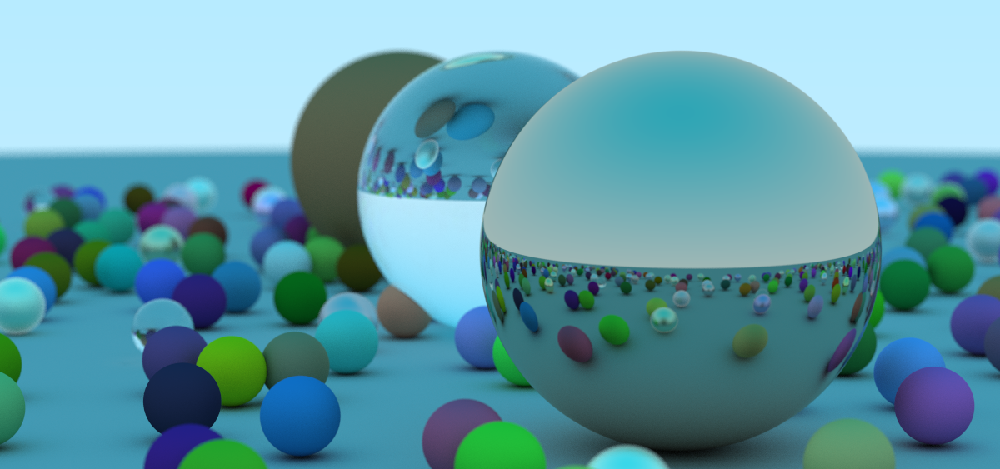

<div align="center">
    <h1>Ray Tracer in Rust</h1>


[](https://github.com/jaskeerat789/ray-tracer/blob/master/LICENSE)

</div>



<strong>This is the implementation of a basic Ray Tracer in Rust. I followed [_Ray Tracing in One Weekend_](https://raytracing.github.io/books/RayTracingInOneWeekend.html) to understand the basics of a ray tracer. I also referred the [Rust Docs](https://www.rust-lang.org/learn). This Project contains -
- Camera Enum with features like variable focus and aperture, movable and simulate different types of lenses. 
- Vec3 Enum, used to define a vector in 3D space.
- Ray Enum, used to define a ray of light.
- Overloaded operator supporting Vector Algebra.
- Sphere Enum, used to define sphere in 3d space.
- Material Enum, used to define physical property of the sphere. Currently supports 3 materials Lambertian, Metallic and Dielectric materials.

Amazing Project for anyone who wants to start learning Rust and understand complex concepts like Traits, Enums, Operator Overloading and Modules </strong>

## Installation and Setup

### Prerequisites
- You should have Rust Toolchain (rustc and cargo). You can install Rust using [Rustup](https://www.rust-lang.org/tools/install)
- Run `rustup update` to update to the latest version of Rust Toolchain

### Setup and running the project :rocket:
- Run `cargo build` to build the project.
- To store the produced image, run `cargo run > /path_to_dir/image.ppm`
- Try opening the `image.ppm` in default image viewer. You can use a online service like [Netpbm](http://paulcuth.me.uk/netpbm-viewer/) to view the raw image.

### Playing around
You are free to change the code in `/src/main.rs` to understand the concepts. To add more sphere, define their physical property and add it to the `world` list. Look at the code below.
```rs
let material_ground = Material::Lambertian{ albedo: Color::new(0.8, 0.8, 0.0) };
let material_center = Material::Lambertian{ albedo: Color::new(0.1, 0.2, 0.5) };
let material_left   = Material::Dielectric{ ref_idx:1.5 };
let material_right  = Material::Metal{ albedo: Color::new(0.8, 0.6, 0.2), fuzz: 0.0 };

list.push(Box::new(Sphere::sphere(Vec3::new( 0.0, -100.5, -1.0 ), 100.0, material_ground )));
list.push(Box::new(Sphere::sphere(Vec3::new( 0.0,    0.0, -1.0 ),   0.5, material_center )));
list.push(Box::new(Sphere::sphere(Vec3::new(-1.0,    0.0, -1.0 ),   0.5, material_left  )));
list.push(Box::new(Sphere::sphere(Vec3::new(-1.0,    0.0, -1.0 ),  -0.45, material_left  )));
list.push(Box::new(Sphere::sphere(Vec3::new( 1.0,    0.0, -1.0 ),   0.5, material_right )));
```
You can also adjust the camera angle, aspect ratio, aperture, focus and field of view. Change the parameters passed into the Camera::new() constructor. 
```
let cam: Camera = Camera::new(
        look_from,
        look_at,
        vup,
        20.0, // vertical field-of-view in degrees
        aspect_ratio,
        aperture,
        dist_to_focus
    );
```
You can also change the resolution of image my defining width of image in `IMAGE_WIDTH` constant variable under `main` function. 

## Contribution to the project

<div align="center">

[](https://github.com/jaskeerat789/ray-tracer/issues) 

</div>

### Git workflow

Please follow a systematic Git Workflow -

- Create a fork of this repo.
- Clone your fork of your repo on your pc.
- [Add Upstream to your clone](https://help.github.com/en/github/collaborating-with-issues-and-pull-requests/configuring-a-remote-for-a-fork)
- **Every change** that you do, it has to be on a branch. Commits on master would directly be closed.
- Make sure that before you create a new branch for new changes,[syncing with upstream](https://help.github.com/en/github/collaborating-with-issues-and-pull-requests/syncing-a-fork) is neccesary.

### Commits

- Write clear meaningful git commit messages (Do read [this](http://chris.beams.io/posts/git-commit/)).
- Make sure your PR's description contains GitHub's special keyword references that automatically close the related issue when the PR is merged. (Check [this](https://github.com/blog/1506-closing-issues-via-pull-requests) for more info)
- When you make very very minor changes to a PR of yours (like for example fixing a failing Travis build or some small style corrections or minor changes requested by reviewers) make sure you squash your commits afterward so that you don't have an absurd number of commits for a very small fix. (Learn how to squash at [here](https://davidwalsh.name/squash-commits-git))
- When you're submitting a PR for a UI-related issue, it would be really awesome if you add a screenshot of your change or a link to a deployment where it can be tested out along with your PR. It makes it very easy for the reviewers and you'll also get reviews quicker.

## Todo
- [ ] Improve Runtime (current focus)
- [ ] Cleaning the code
- [ ] Complete test for the vector Algebraic functions 

## Thank you!